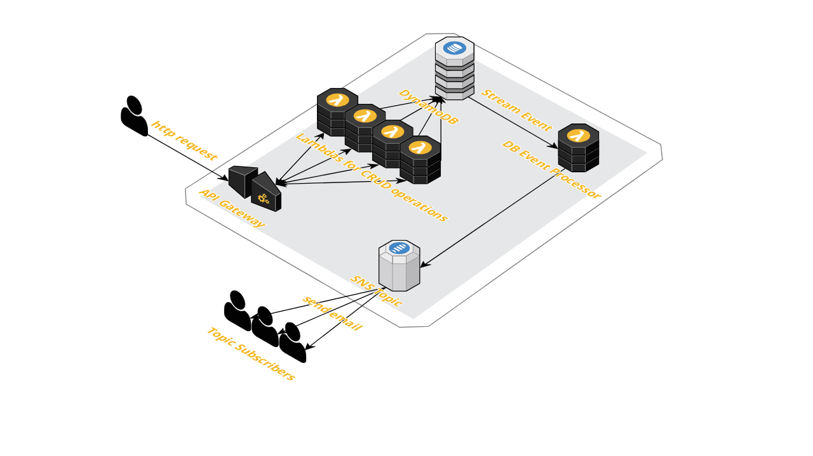

# Microservice for CRUD DB operations using aws serverless infrastructure
- API Gateway
- Lambdas
- SNS
- DynamoDB + stream

## Installation

```
aws s3 mb s3://rahzel-package --region us-east-2
npm install
```

## Uninstall
```
aws --region us-east-2 cloudformation delete-stack --stack-name sam-dynamo-apigw
```

## frontend:
https://github.com/rahzell/react-todo


## blueprint


##TODO:
- stream reject-ről küldjön újjabb sns-t
- separate subscripson resource
- give IAM Policy and Role as resource seperated based on VendorPolicy